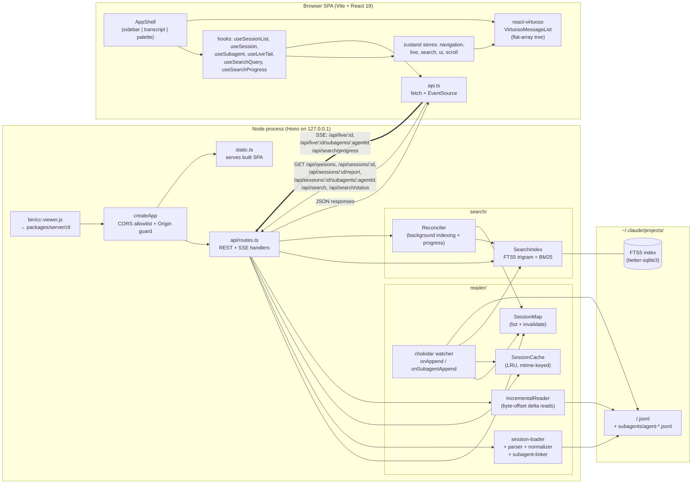

# cc-transcript-viewer

Local web-UI viewer for Claude Code conversation transcripts.

## Install & run

```bash
npx github:carlosxl/cc-transcript-viewer#v0.1.0
```

Requires Node.js 20+ and read access to the private repo (GitHub SSH key
or HTTPS token in your git credential helper). The first run takes ~30s to
clone, install dependencies, and build; subsequent runs are cached by npx.

The server starts on a free localhost port and opens your browser to it.
Use Ctrl+C to stop.

To update to a newer version, re-run with the new tag:

```bash
npx github:carlosxl/cc-transcript-viewer#v0.2.0
```

## Architecture

One process. The CLI starts a local Hono server bound to `127.0.0.1`, which
serves both the built React SPA (static assets) and a small REST + SSE API.
The browser talks to that same origin — no cross-origin, no auth, no outbound
network.



### How the pieces interact

- **Read path (cold).** Browser requests `/api/sessions/:id` → route validates
  the id, resolves the JSONL file under `projectsDir`, calls
  `loadSessionFromDisk` (parser → normalizer → subagent-linker), caches the
  result in `SessionCache` keyed by `mtimeMs`, returns the typed
  `SessionDetailResponse`. UI hands it to `react-virtuoso` via a flat-array
  tree built in Zustand (expanded subagents and tool calls are spliced into
  the same array — never nested Virtuosos).
- **Live tail.** `chokidar` watches `~/.claude/projects/` for JSONL appends.
  On each append, `IncrementalReader` reads only the new bytes, the SSE route
  `/api/live/:id` pushes the resulting `Turn[]` to the browser, and the
  watcher also invalidates `SessionMap` + `SessionCache` so the next REST
  fetch sees fresh data. Subagent JSONL files have their own SSE channel.
- **Search.** `SearchReconciler` walks `SessionMap` in the background and
  feeds new/changed files into `SearchIndex` (FTS5 with the trigram
  tokenizer, persisted to `<cacheDir>/search.db`). `/api/search` runs ranked
  BM25 queries; `/api/search/progress` SSE streams indexing progress for the
  footer indicator.
- **Distribution.** `bin/cc-viewer.js` is an ESM shim with a guaranteed
  shebang; it delegates to the compiled CLI which builds the app context and
  binds to a free port on `127.0.0.1`. The SPA is built ahead of time and
  copied into `packages/server/public/`, so one process serves both static
  assets and the API.

## Development

```bash
npm install
npm run typecheck  # must be green before committing
npm run build
```

## Notes

### Empty thinking blocks

Sessions captured by Claude Code 2.1.69+ on Opus 4.7 store thinking blocks
with an empty `thinking` field — only the encrypted signature is persisted.
This is upstream behavior: Anthropic's API defaults Opus 4.7 thinking blocks
to `display: "omitted"`, and Claude Code does not override the default.
Tracking: [anthropics/claude-code#30958](https://github.com/anthropics/claude-code/issues/30958).

To capture summaries in **future** sessions, add to `~/.claude/settings.json`:

```json
{
  "env": {
    "CLAUDE_CODE_EXTRA_BODY": "{\"thinking\":{\"type\":\"adaptive\",\"display\":\"summarized\"}}"
  }
}
```

Or launch with `claude --thinking-display summarized`. Past sessions stay
empty — the text was never written to disk.

### `prebuild-install` deprecation warning during `npx` install

You may see this during the first `npx` run:

```
npm warn deprecated prebuild-install@7.1.3: No longer maintained. …
```

It comes from `better-sqlite3` (our SQLite + FTS5 binding) — every current
version of which still pulls `prebuild-install` to fetch its native binary.
The warning is harmless: the install succeeds, the binary works. Tracking
upstream: [WiseLibs/better-sqlite3#1463](https://github.com/WiseLibs/better-sqlite3/issues/1463)
(see also PRs [#1446](https://github.com/WiseLibs/better-sqlite3/pull/1446)
and [#655](https://github.com/WiseLibs/better-sqlite3/issues/655) which
propose migrating to `node-gyp` / `prebuildify`).

## License

MIT
